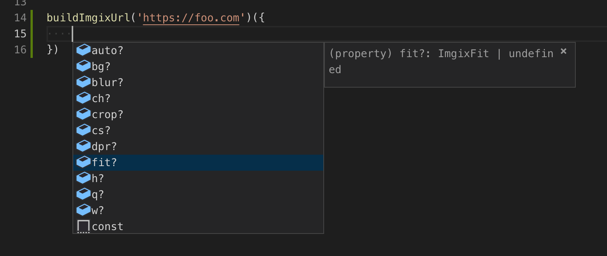
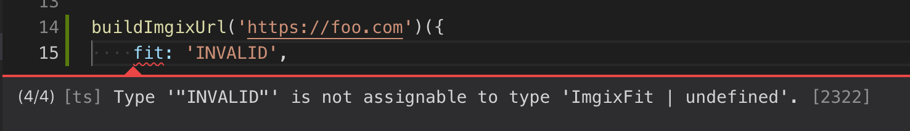
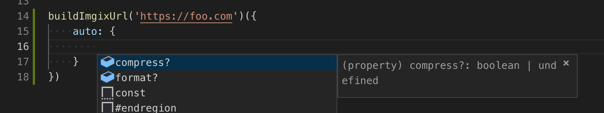

# ts-imgix

Strongly-typed imgix URL builder function, `buildImgixUrl`.

```ts
import * as assert from 'assert';
import { buildImgixUrl } from 'ts-imgix';

assert.strictEqual(
    buildImgixUrl('https://foo.com')({
        auto: {
            format: true,
        },
        w: 300,
    }),
    'https://foo.com/?auto=format&w=300',
);
```





## Installation

```sh
yarn add ts-imgix
npm install ts-imgix
```

## Development

```
yarn
npm run start
```

Help wanted! TODO:

-   Remove dependencies: `funfix-core`
